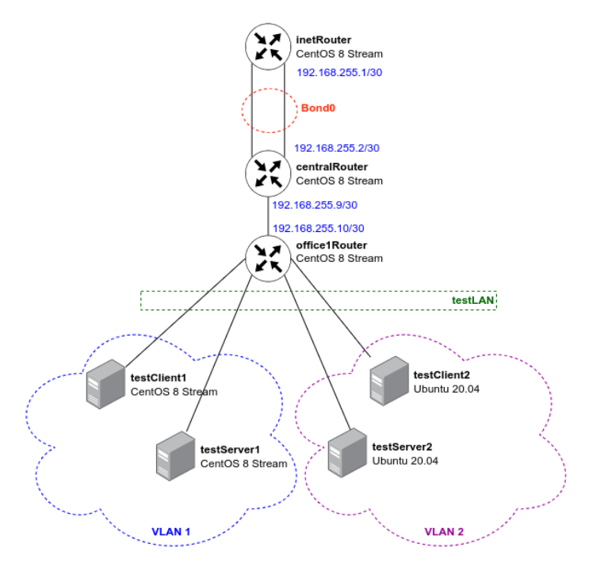

#  VLAN

1. При  помощи vagrant настроил сеть согласно схеме 
2. Объеденил vlan согласно схеме 
    - VLAN1 testClient1, testServer1
    - VLAN2 testClient2, testServer2
3. Настроил LACP между хостами inetRouter и centralRouter 
